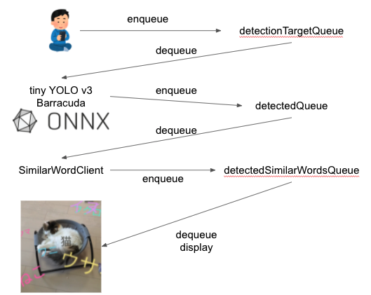

# ARWithWord

- English blog: https://shibuiyusuke.medium.com/showing-word-clouds-in-ar-8a8a89c9298
- Japanese blog: https://qiita.com/cvusk/items/5f753be55531b2dee608

## What I made

I made a AR camera application that can detect an object via camera and display its name and related words in augmented reality.

<iframe width="560" height="315" src="https://www.youtube.com/embed/DA023y8TVRc" title="YouTube video player" frameborder="0" allow="accelerometer; autoplay; clipboard-write; encrypted-media; gyroscope; picture-in-picture" allowfullscreen></iframe>


## Why I made it

Many AR applications displays object or image in the space, like Google's AR search.
https://blog.google/around-the-globe/google-asia/japanese-characters-ar/

Although there are a plenty of AR applications that shows visual effect via camera, I see a few that deals with natural language. I agree that these applications are brilliant, while I also believe in power of words, that people recognize the world with language and the AR is one representation of the world. There may be a possibility that word can do something in AR world.
So I decided to make a mock application that shows word cloud in AR.

## What is word cloud

The word cloud is a form of data visualization oftenly used in natural language processing that visualize important words bigger in a plane to explain a text, like below.


You can understant a context of the text by just looking at the word cloud.
While many word clouds are made in 2 dimensional image, I thought of making it in 3 dimensional AR space.

## How I made it

### Overview


The basis of the AR application is made with Unity and AR Foundation. I use tiny YOLO v3 model to run object detection in the camera to retrieve a name of an object. The related words for the object is obtained from fastText API, deployed on Kubernetes in GCP. So I made Unity-based AR application and container-based REST API on Kubernetes with fastText. It is a combination of AR, Edge AI, and server-side AI.


### AR
I used Unity to develop AR application with [AR Foundation](https://docs.unity3d.com/Packages/com.unity.xr.arfoundation@4.2/manual/index.html).

### Object detection
The object detection is executed on [Unity Barracuda](https://github.com/Unity-Technologies/barracuda-release) with [tiny YOLO v3](https://github.com/onnx/models/tree/master/vision/object_detection_segmentation/tiny-yolov3) loaded. I first tried [Unity Perception](https://github.com/Unity-Technologies/com.unity.perception) for the runtime, though I couldn't succeed installing it.

The model is pretrained [ONNX tiny YOLO v3](https://github.com/onnx/models/tree/master/vision/object_detection_segmentation/tiny-yolov3) with [COCOデータセット](https://cocodataset.org/#home) for training dataset. So the only things the model can detect are [those 80 categories in the list](https://github.com/shibuiwilliam/ARWithWord/blob/main/ARWithWord/Assets/Scripts/Constants.cs).

### Natural language processing

I used [fastText](https://github.com/facebookresearch/fastText) to find related words for the detected object. The fastText is a word vector model by Facebook that can be used to search for words in close vector distance. The model I used is [a pretrained model with using Wikipedia for dataset](https://github.com/facebookresearch/fastText/blob/master/docs/crawl-vectors.md).
Since the vector model is quite huge, over few GB, to be loaded to a smartphone, I made a REST API server to serve the fastText similar word search.

## More specific

### Unity

The code I developed in Unity is in can be found in the repository below.
https://github.com/shibuiwilliam/ARWithWord/tree/main/ARWithWord

The Unity application is based on 3D project.


I added some packages to make AR and Edge AI work in the Unity.

- AR Foundatior
- Barracuda: [See here](https://docs.unity3d.com/Packages/com.unity.barracuda@1.0/manual/Installing.html). If you cannnot find the package in the Package Manager, you can install Barracuda with `Add package from git URL` and `com.unity.barracuda`.
- Android Logcat: Logging tool for Android via Unity.


After I installed packages, I added some AR related components: `AR Session Origin`, `AR Raycast Manager`, `AR Anchor Manager`, and `AR Plane Manager`. In addition, I made `ObjectDetector` for object detection and `SimilarWordClient` for sending request to fastText API.


The spawning code for the AR Session Origin is in `SpawnManager.cs`.

```csharp
// SpawnManager.cs

using System;
using System.Collections;
using System.Collections.Generic;
using System.IO;
using System.Linq;

using UnityEngine;
using UnityEngine.UI;
using UnityEngine.XR.ARFoundation;
using UnityEngine.XR.ARSubsystems;
using Unity.Collections;
using Unity.Collections.LowLevel.Unsafe;
using Unity.Barracuda;

public class DetectionTarget
{
    public Texture2D CurrentTexture2D;
    public Pose HitPose;
}

public class Detected
{
    public Pose HitPose;
    public IList<ItemDetected> ItemsDetected;
}

public class DetectedSimilarWords
{
    public Pose HitPose;
    public SimilarWords SimilarWords;
}

public class SpawnManager : MonoBehaviour
{
    [SerializeField] GameObject goText;

    [SerializeField]
    ARCameraManager m_arCameraManager;
    public ARCameraManager arCameraManager
    {
        get { return m_arCameraManager; }
        set { m_arCameraManager = value; }
    }

    [SerializeField]
    GameObject m_goObjectDetector;
    public GameObject goObjectDetector
    {
        get { return m_goObjectDetector; }
        set { m_goObjectDetector = value; }
    }
    private ObjectDetector objectDetector;


    [SerializeField]
    GameObject m_goSimilarWordClient;
    public GameObject goSimilarWordClient
    {
        get { return m_goSimilarWordClient; }
        set { m_goSimilarWordClient = value; }
    }
    private SimilarWordClient similarWordClient;

    public float shiftX = 0f;
    public float shiftY = 0f;
    public float scaleFactor = 1;

    private ARRaycastManager arRaycastManager;
    private List<ARRaycastHit> hits = new List<ARRaycastHit>();

    private static Texture2D _texture;

    private bool isDetecting = false;

    Texture2D m_Texture;

    Queue<DetectionTarget> detectionTargetQueue = new Queue<DetectionTarget>();
    Queue<Detected> detectedQueue = new Queue<Detected>();
    Queue<DetectedSimilarWords> detectedSimilarWordsQueue = new Queue<DetectedSimilarWords>();

    private List<Color32> colors = new List<Color32>() {
        new Color32(255, 115, 200, 255),
        new Color32(241, 233, 137, 255),
        new Color32(108, 109, 101, 255),
        new Color32(128, 244, 222, 255),
        new Color32(134, 222, 249, 255),
        new Color32(228, 178, 249, 255)
    };

    private void OnEnable()
    {
        Debug.Log("initialize AR camera manager frame received");
        m_arCameraManager.frameReceived += OnCameraFrameReceived;
        _texture = new Texture2D(1, 1);
        _texture.SetPixel(0, 0, new Color(0.3843137f, 0, 0.9333333f));
        _texture.Apply();
    }

    void Start()
    {
        this.arRaycastManager = GetComponent<ARRaycastManager>();

        this.objectDetector = goObjectDetector.GetComponent<TinyYolo3Detector>();
        this.objectDetector.Start();

        this.similarWordClient = goSimilarWordClient.GetComponent<SimilarWordClient>();
        this.similarWordClient.Start();

    }

    void Update()
    {
        if (Input.touchCount > 0)
        {
            Touch touch = Input.GetTouch(0);
            if (touch.phase == TouchPhase.Began)
            {
                if (arRaycastManager.Raycast(touch.position, hits, TrackableType.PlaneWithinPolygon))
                {
                    Pose hitPose = hits[0].pose;
                    var detectionTarget = new DetectionTarget
                    {
                        CurrentTexture2D = this.m_Texture,
                        HitPose = hitPose
                    };
                    this.detectionTargetQueue.Enqueue(detectionTarget);
                    Debug.Log($"touched ({hitPose.position.x}, {hitPose.position.y}, {hitPose.position.z})!");
                }
            }
        }

        if (this.detectedSimilarWordsQueue.Count() > 0)
        {
            var detectedSimilarWord = this.detectedSimilarWordsQueue.Dequeue();
            Debug.Log($"similar word for {detectedSimilarWord.SimilarWords.word} has {detectedSimilarWord.SimilarWords.predictions.Count()} predictions");

            AllocateItem(detectedSimilarWord.SimilarWords.word, detectedSimilarWord.HitPose.position, detectedSimilarWord.HitPose.rotation);

            int i = 0;
            foreach (var prediction in detectedSimilarWord.SimilarWords.predictions)
            {
                Debug.Log($"{i} process {prediction.similar_word} with {prediction.similarity}");

                var hitPoseRandom = new Vector3(detectedSimilarWord.HitPose.position.x, detectedSimilarWord.HitPose.position.y, detectedSimilarWord.HitPose.position.z);

                float rX = UnityEngine.Random.Range(-1.0f, 1.0f);
                float rY = UnityEngine.Random.Range(-1.0f, 1.0f);
                float rZ = UnityEngine.Random.Range(-1.0f, 1.0f);
                hitPoseRandom.x += rX;
                hitPoseRandom.y += rY;
                hitPoseRandom.z += rZ;
                
                AllocateItem(prediction.similar_word, hitPoseRandom, detectedSimilarWord.HitPose.rotation);
            }
        }

        RequestSimilarWord();
    }


    private void AllocateItem(string word, Vector3 hitPose, Quaternion hitRotation)
    {
        Debug.Log($"allocate {word}");

        this.goText.GetComponent<TextMesh>().text = word;
        int colorIndex = UnityEngine.Random.Range(0, colors.Count());
        this.goText.GetComponent<TextMesh>().color = this.colors[colorIndex];

        int characterSize = UnityEngine.Random.Range(6, 18);
        this.goText.GetComponent<TextMesh>().characterSize = characterSize;

        Instantiate(goText, hitPose, hitRotation);
        Debug.Log($"allocated {word} on {hitPose.x}, {hitPose.y}, {hitPose.z}");
    }

    unsafe void OnCameraFrameReceived(ARCameraFrameEventArgs eventArgs)
    {
        if (!arCameraManager.TryAcquireLatestCpuImage(out XRCpuImage image))
        {
            return;
        }

        var conversionParams = new XRCpuImage.ConversionParams
        {
            inputRect = new RectInt(0, 0, image.width, image.height),
            outputDimensions = new Vector2Int(image.width, image.height),
            outputFormat = TextureFormat.RGBA32,
            transformation = XRCpuImage.Transformation.None
        };
        int imageSize = image.GetConvertedDataSize(conversionParams);
        var buffer = new NativeArray<byte>(imageSize, Allocator.Temp);
        image.Convert(conversionParams, new IntPtr(buffer.GetUnsafePtr()), buffer.Length);
        image.Dispose();

        this.m_Texture = new Texture2D(
            conversionParams.outputDimensions.x,
            conversionParams.outputDimensions.y,
            conversionParams.outputFormat,
            false
        );
        this.m_Texture.LoadRawTextureData(buffer);
        this.m_Texture.Apply();
        buffer.Dispose();

        Detect();
    }

    private void Detect()
    {
        if (this.isDetecting)
        {
            return;
        }
        if (this.detectionTargetQueue.Count() == 0)
        {
            return;
        }

        var detectionTarget = this.detectionTargetQueue.Dequeue();
        this.isDetecting = true;
        StartCoroutine(
            ProcessImage(
                this.objectDetector.IMAGE_SIZE, detectionTarget.CurrentTexture2D, picture =>
                {
                    StartCoroutine(
                        this.objectDetector.Detect(
                            picture, itemsDetected =>
                            {
                                if (itemsDetected.Count > 0)
                                {
                                    var detected = new Detected
                                    {
                                        HitPose = detectionTarget.HitPose,
                                        ItemsDetected = itemsDetected,
                                    };
                                    this.detectedQueue.Enqueue(detected);
                                }
                                Resources.UnloadUnusedAssets();
                                this.isDetecting = false;
                            }
                        )
                    );
                }
            )
        );
    }


    private IEnumerator ProcessImage(int inputSize, Texture2D texture2D, Action<Color32[]> callback)
    {
        Coroutine croped = StartCoroutine(
            TextureTools.CropSquare(
                texture2D, TextureTools.RectOptions.Center, snap =>
                {
                    var scaled = Scale(snap, inputSize);
                    var rotated = Rotate(scaled.GetPixels32(), scaled.width, scaled.height);
                    callback(rotated);
                }
            )
        );
        yield return croped;
    }


    private Texture2D Scale(Texture2D texture, int imageSize)
    {
        Texture2D scaled = TextureTools.scaled(texture, imageSize, imageSize, FilterMode.Bilinear);
        return scaled;
    }


    private Color32[] Rotate(Color32[] pixels, int width, int height)
    {
        Color32[] rotate = TextureTools.RotateImageMatrix(pixels, width, height, 90);
        return rotate;
    }

    private void RequestSimilarWord()
    {
        if (this.detectedQueue.Count()==0)
        {
            return;
        }

        var detected = this.detectedQueue.Dequeue();
        StartCoroutine(
            this.similarWordClient.SimilarWordAPI(
                detected.ItemsDetected[0].PredictedItem.Label, 20, results =>
                {
                    Debug.Log($"result {results}");
                    var detectedSimilarWords = new DetectedSimilarWords
                    {
                        HitPose = detected.HitPose,
                        SimilarWords=results,
                    };
                    this.detectedSimilarWordsQueue.Enqueue(detectedSimilarWords);
                }
            )
        );
    }
}

```

The workflow in the code is like this:



The processes are made asynchronous with them connected with Queues. I chose asynchronous queue to let object detection and similar word request not affect UI latency.
Image in the AR camera can be obtain in `OnCameraFrameReceived` method. You can refer to [the official document](https://docs.unity3d.com/Packages/com.unity.xr.arfoundation@4.0/manual/cpu-camera-image.html) for how it works.
Once you touch the smartphone display, the object detector will run prediction to the latest camera image. The application retrieves the position and the label of the object, and enqueue the data to be used in similar word search.

```csharp
// TinyYolo3Detector.cs

using System;
using UnityEngine;
using Unity.Barracuda;
using System.Linq;
using System.Collections;
using System.Collections.Generic;


public class Parameters
{
    public int ROW_COUNT;
    public int COL_COUNT;
    public int CELL_WIDTH;
    public int CELL_HEIGHT;
    public Parameters(int ROW_COUNT, int COL_COUNT, int CELL_WIDTH, int CELL_HEIGHT)
    {
        this.ROW_COUNT = ROW_COUNT;
        this.COL_COUNT = COL_COUNT;
        this.CELL_WIDTH = CELL_WIDTH;
        this.CELL_HEIGHT = CELL_HEIGHT;
    }
}

public class TinyYolo3Detector : MonoBehaviour, ObjectDetector
{

    public NNModel modelFile;

    // English or Japanese
    public enum LabelLanguages
    {
        EN,
        JP
    };
    public LabelLanguages labelLanguage;


    public string inputName;
    public string outputNameL;
    public string outputNameM;

    private const int IMAGE_MEAN = 0;
    private const float IMAGE_STD = 255.0F;
    private const int _IMAGE_SIZE = 416;
    public int IMAGE_SIZE
    {
        get => _IMAGE_SIZE;
    }

    public float minConfidence = 0.25f;

    private IWorker worker;
    private Model model;

    public Parameters paramsL = new Parameters(13, 13, 32, 32);
    public Parameters paramsM = new Parameters(26, 26, 16, 16);

    public const int BOXES_PER_CELL = 3;
    public const int BOX_INFO_FEATURE_COUNT = 5;

    private int classLength;
    private string[] labels;


    public void Start()
    {
        switch(this.labelLanguage)
        {
            case LabelLanguages.EN:
                this.labels = Constants.cocoLabelEN;
                break;
            case LabelLanguages.JP:
                this.labels = Constants.cocoLabelJP;
                break;
            default:
                this.labels = Constants.cocoLabelEN;
                break;
        }
        this.classLength = this.labels.Length;

        this.model = ModelLoader.Load(this.modelFile);
        this.worker = GraphicsWorker.GetWorker(this.model);
        Debug.Log($"Initialized model and labels: {this.classLength} classes");
    }


    public IEnumerator Detect(Color32[] picture, Action<IList<ItemDetected>> callback)
    {
        Debug.Log("Run detection");
        using (var tensor = TransformInput(picture, this.IMAGE_SIZE, this.IMAGE_SIZE))
        {
            var inputs = new Dictionary<string, Tensor>();
            inputs.Add(this.inputName, tensor);
            yield return StartCoroutine(this.worker.StartManualSchedule(inputs));
            var outputL = this.worker.PeekOutput(this.outputNameL);
            var outputM = this.worker.PeekOutput(this.outputNameM);
            List<ItemDetected> results = ParseOutputs(outputL, outputM, this.paramsL, this.paramsM);
            Debug.Log($"yielded {results.Count()} results");
            callback(results);
        }
    }


    public static Tensor TransformInput(Color32[] pic, int width, int height)
    {
        float[] floatValues = new float[width * height * 3];

        for (int i = 0; i < pic.Length; ++i)
        {
            Color32 color = pic[i];

            floatValues[i * 3 + 0] = (color.r - IMAGE_MEAN) / IMAGE_STD;
            floatValues[i * 3 + 1] = (color.g - IMAGE_MEAN) / IMAGE_STD;
            floatValues[i * 3 + 2] = (color.b - IMAGE_MEAN) / IMAGE_STD;
        }

        return new Tensor(1, height, width, 3, floatValues);
    }

    private List<ItemDetected> ParseOutputs(Tensor yoloModelOutputL, Tensor yoloModelOutputM, Parameters parametersL, Parameters parametersM)
    {
        var itemsInCenter = new List<ItemDetected>();

        for (var box = 0; box < BOXES_PER_CELL; box++)
        {
            for (int cy = 0; cy < parametersL.COL_COUNT; cy++)
            {
                for (var cx = 0; cx < parametersL.ROW_COUNT; cx++)
                {
                    var result = Parse(cx, cy, box, yoloModelOutputL);
                    if (result != null)
                    {
                        itemsInCenter.Add(result);
                    }
                }
            }

            for (int cy = 0; cy < parametersM.COL_COUNT; cy++)
            {
                for (var cx = 0; cx < parametersM.ROW_COUNT; cx++)
                {
                    var result = Parse(cx, cy, box, yoloModelOutputM);
                    if (result != null)
                    {
                        itemsInCenter.Add(result);
                    }
                }
            }
        }

        return itemsInCenter;
    }

    private ItemDetected Parse(int cx, int cy, int box, Tensor yoloModelOutput)
    {
        var channel = (box * (this.classLength + BOX_INFO_FEATURE_COUNT));
        float confidence = GetConfidence(yoloModelOutput, cx, cy, channel);
        if (confidence < this.minConfidence)
        {
            return null;
        }

        float[] predictedClasses = ExtractClasses(yoloModelOutput, cx, cy, channel);
        var (topResultIndex, topResultScore) = GetTopResult(predictedClasses);
        var topScore = topResultScore * confidence;
        if (topScore < this.minConfidence)
        {
            return null;
        }

        var itemInCenter = new ItemDetected
        {
            PredictedItem = new Prediction
            {
                Label = labels[topResultIndex],
                Confidence = topScore,
            }
        };

        return itemInCenter;
    }


    private float Sigmoid(float value)
    {
        var k = (float)Math.Exp(value);
        return k / (1.0f + k);
    }


    private float[] Softmax(float[] values)
    {
        var maxVal = values.Max();
        var exp = values.Select(v => Math.Exp(v - maxVal));
        var sumExp = exp.Sum();
        return exp.Select(v => (float)(v / sumExp)).ToArray();
    }


    private float GetConfidence(Tensor modelOutput, int x, int y, int channel)
    {
        return Sigmoid(modelOutput[0, x, y, channel + 4]);
    }

    public float[] ExtractClasses(Tensor modelOutput, int x, int y, int channel)
    {
        float[] predictedClasses = new float[this.classLength];
        int predictedClassOffset = channel + BOX_INFO_FEATURE_COUNT;

        for (var predictedClass = 0; predictedClass < this.classLength; predictedClass++)
        {
            predictedClasses[predictedClass] = modelOutput[0, x, y, predictedClass + predictedClassOffset];
        }

        return Softmax(predictedClasses);
    }


    private ValueTuple<int, float> GetTopResult(float[] predictedClasses)
    {
        return predictedClasses
            .Select((predictedClass, index) => (Index: index, Value: predictedClass))
            .OrderByDescending(result => result.Value)
            .First();
    }


    private List<ValueTuple<int, float>> GetOrderedResult(float[] predictedClasses)
    {
        return predictedClasses
            .Select((predictedClass, index) => (Index: index, Value: predictedClass))
            .OrderByDescending(result => result.Value)
            .ToList();
    }
}
```

In the object detection, the `TransformInput` method will convert the image into Tensor and resize it. `PeekOut` obtains prediction from the object detection.  You can find the network layers of the object detection ONNX model in Unity.


The `SimilarWordClient` sends request to fastText API in Kubernetes cluster. I used [UnityWebRequest](https://docs.unity3d.com/ja/2021.1/ScriptReference/Networking.UnityWebRequest.html) to implement the client. Its input and output are both JSON.

```csharp
// SimilarWordClient.cs

using System;
using System.Collections;
using System.Collections.Generic;
using UnityEngine;
using UnityEngine.Networking;

[Serializable]
public class SecretJson
{
    public string url;
    public string secret;
}

[Serializable]
public class PostData
{
    public string word;
    public int topn;
}

[Serializable]
public class SimilarWord
{
    public string similar_word;
    public float similarity;
}

[Serializable]
public class SimilarWords
{
    public string word;
    public SimilarWord[] predictions;
}


public class SimilarWordClient : MonoBehaviour
{
    public TextAsset secretFile;
    private string secretString;
    private SecretJson secretJson;
    private string similarWordUrl;

    public void Start()
    {
        this.secretString = Resources.Load<TextAsset>(this.secretFile.name).ToString();
        this.secretJson = SecretJson.Deserialize(this.secretString);
        this.similarWordUrl = $"{this.secretJson.url}/similar-word/";
    }

    public IEnumerator SimilarWordAPI(string word, int topn, Action<SimilarWords> callback)
    {
        using (var request = new UnityWebRequest(this.similarWordUrl, "POST"))
        {
            Debug.Log($"Request {word} for {topn}");
            PostData postData = new PostData();
            postData.word = word;
            postData.topn = topn;
            string postJson = PostData.Serialize(postData);
            byte[] byteData = System.Text.Encoding.UTF8.GetBytes(postJson);

            request.uploadHandler = (UploadHandler)new UploadHandlerRaw(byteData);
            request.downloadHandler = (DownloadHandler)new DownloadHandlerBuffer();
            request.SetRequestHeader("accept", "application/json");
            request.SetRequestHeader("Content-Type", "application/json");
            request.SetRequestHeader("X-API-KEY", this.secretJson.secret);
            yield return request.SendWebRequest();

            if (request.result == UnityWebRequest.Result.ConnectionError || request.result == UnityWebRequest.Result.ProtocolError)
            {
                Debug.Log("Error POST request");
                Debug.Log(request.error);
            }
            else
            {
                Debug.Log($"status code [{request.responseCode}]");
                if (request.responseCode==200)
                {
                    Debug.Log("POST request succeeded");
                    string json = request.downloadHandler.text;
                    SimilarWords similarWords = SimilarWords.Deserialize(json);
                    callback(similarWords);
                }
                else
                {
                    Debug.Log("POST request failed");
                }
            }
        }
    }

    public void Update()
    {
        
    }
}
```

### Kubernetes and similar word search REST API

You can find the source code for backend in the repository.
https://github.com/shibuiwilliam/ARWithWord/tree/main/backend

I used a pretrained fastText model. The model file is 4GB large in zip, 7GB extracted and needs 15GB RAM to be loaded to memory. It is apparently too big, so I reduced the dimension from 300 to 100 vectors. The new model is now 2GB in size with 4GB for memory. You can find the dimension reduction in the [document](https://github.com/facebookresearch/fastText/blob/master/docs/crawl-vectors.md#adapt-the-dimension).

For the REST API server, I chose [FastAPI](https://fastapi.tiangolo.com/ja/). I have tried many Python web frameworks, and found [FastAPI](https://fastapi.tiangolo.com/ja/) is best balanced in development and performance.


```python
import os
from typing import List, Tuple, Dict
import shutil
import gzip
from urllib.request import urlopen

import fasttext
import fasttext.util
from gensim.models.fasttext import load_facebook_model
from google.cloud import storage

from fastapi import APIRouter, HTTPException, Security
from fastapi.security.api_key import APIKeyHeader
from starlette import status

from logging import getLogger

from src.constants import LANGUAGE_ENUM
from src.data.schema import Prediction, Predictions, PredictionRequest


logger = getLogger(__name__)

class SimilarWordPredictor(object):
    def __init__(
        self,
        bucket_name: str,
        model_directory: str = "/opt/",
        language: LANGUAGE_ENUM = LANGUAGE_ENUM.ENGLISH,
        model_dimension: int = 100,
        threshold: float = 0.6,
    ):
        self.bucket_name = bucket_name
        self.client = storage.Client()
        self.bucket = self.client.get_bucket(self.bucket_name)

        self.model_directory = model_directory
        self.language = language
        self.model_dimension = model_dimension
        if self.model_dimension not in [100, 300]:
            raise ValueError("model dimension must be one of 100 or 300")

        self.file_path = self.download_model(force_download=False)
        self.fasttext_predictor = load_facebook_model(self.file_path)
        logger.info(f"loaded {self.file_path}")

        self.threshold = threshold

        # local cache
        self.cache: Dict[str, Predictions] = {}

    def predict(
        self,
        word: str,
        topn: int = 20,
    ) -> Predictions:
        logger.info(f"predict {word}")

        key = f"{word}_{topn}"
        if key in self.cache.keys():
            return self.cache[key]

        results = self.fasttext_predictor.wv.most_similar(
            word,
            topn=topn,
        )

        _predictions = []
        for r in results:
            if r[1] < self.threshold:
                continue
            if repr(r[0]).startswith("'\\u"):
                continue
            _predictions.append(
                Prediction(
                    similar_word=r[0],
                    similarity=r[1],
                )
            )
        logger.info(f"{word} prediction: {_predictions}")
        predictions = Predictions(
            word=word,
            predictions=_predictions,
        )

        self.cache[key] = predictions

        return predictions

    def download_model(
        self,
        force_download: bool = False,
    ):
        file_name = f"cc.{self.language.value}.{self.model_dimension}.bin"
        file_path = os.path.join(self.model_directory, file_name)
        logger.info(f"retrieve model {file_name}")

        if os.path.exists(file_path):
            if not force_download:
                logger.info(f"model {file_name} exists")
                return file_path

        blob = self.bucket.blob(file_name)
        blob.download_to_filename(file_path)

        logger.info(f"retrieved model {file_name}")

        return file_path


similar_word_predictor = SimilarWordPredictor(
    bucket_name=os.environ["BUCKET_NAME"],
    model_directory=os.getenv("MODEL_DIRECTORY", "/opt/"),
    language=LANGUAGE_ENUM[os.getenv("LANGUAGE", "ENGLISH").upper()],
    model_dimension=int(os.getenv("MODEL_DIMENSION", 100)),
    threshold=float(os.getenv("THRESHOLD", 0.6)),
)


router = APIRouter()

api_key_header_auth = APIKeyHeader(
    name="X-API-KEY",
    auto_error=True,
)


def get_api_key(api_key_header: str = Security(api_key_header_auth)):
    if api_key_header != os.environ["PASSPHRASE"]:
        raise HTTPException(
            status_code=status.HTTP_401_UNAUTHORIZED,
            detail="Invalid API Key",
        )


@router.post(
    "/",
    response_model=Predictions,
    dependencies=[Security(get_api_key)],
)
def predict(
    prediction_request: PredictionRequest,
):
    predictions = similar_word_predictor.predict(
        word=prediction_request.word,
        topn=prediction_request.topn,
    )
    return predictions


@router.get(
    "/sample/",
    response_model=Predictions,
    dependencies=[Security(get_api_key)],
)
def predict_sample():
    predictions = similar_word_predictor.predict(
        word="ネコ",
        topn=20,
    )
    return predictions
```

The REST API server is made to be deployed on GCP GKE, Kubernetes cluster. The fastText model is stored in my GCP storage, and is downloaded each time the server spawned.

## Finally

It looks like this.

<iframe width="560" height="315" src="https://www.youtube.com/embed/DA023y8TVRc" title="YouTube video player" frameborder="0" allow="accelerometer; autoplay; clipboard-write; encrypted-media; gyroscope; picture-in-picture" allowfullscreen></iframe>

## So why I made it

The application is not made to solve some specific issue. Rather, I aimed to make an example of combining AR, Edge AI and natural language processing to add AI for image and natural language to AR world.
I believe the AI for image has good compatibility with AR, and since the human beings recognize the world with word, I am sure there is a high possibility of even using natural language into AR to expand the reality.

Thank you!
https://github.com/shibuiwilliam/ARWithWord
